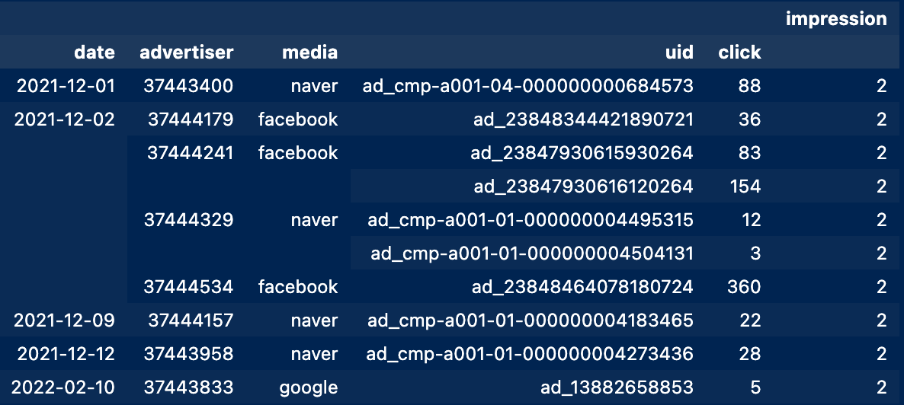
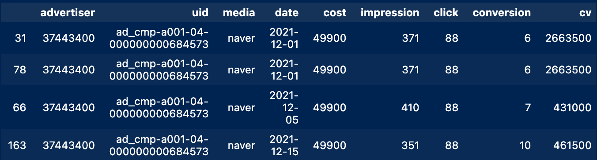
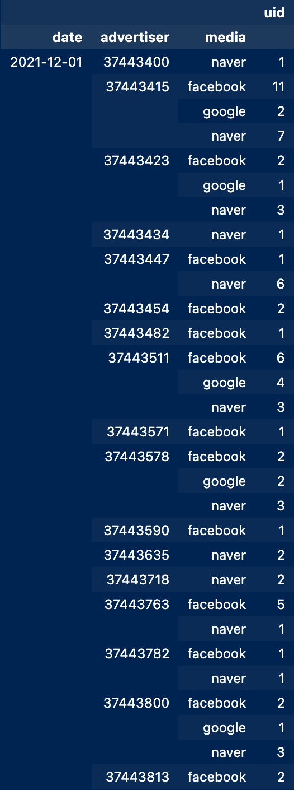
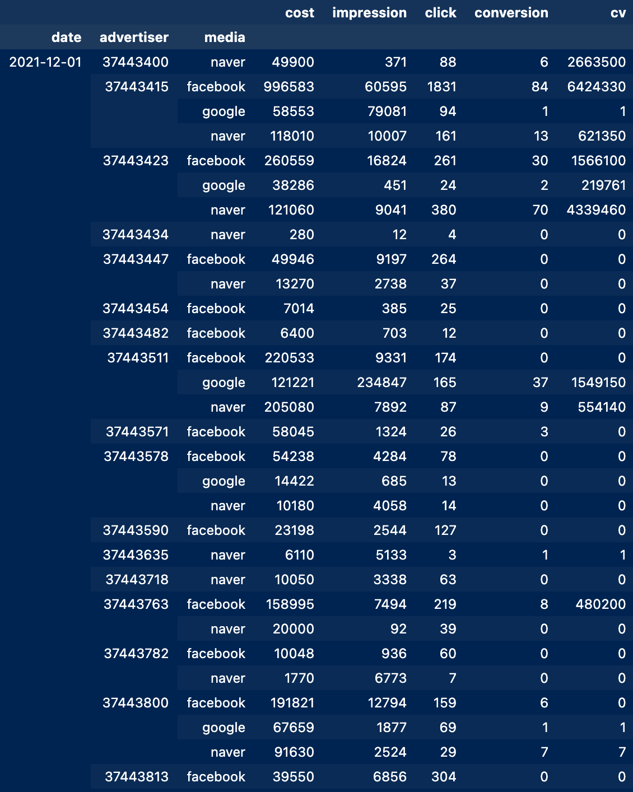

# Contexts
* [Check ups](#check-ups)
* [Data Validation](#data-validation)
* [Group Summation](#group-summation)
* [Summary](#summary)

## Check ups
```python
# data.shape    # (79858, 9)
filepaths = sorted(glob(f'{os.getcwd()}/*.csv'))
parser = lambda x: datetime.datetime.strptime(x, "%Y.%m.%d")

data = pd.read_csv(filepaths[0], parse_dates=[3], date_parser=parser)

len(data.advertiser.value_counts()) # 284
len(data.date.value_counts())   # 140
len(data.uid.unique())  # 1781
```

현재 제공받은 데이터로 확인할 수 있는 광고주의 수는 284, 해당 데이터는 140일 동안의 기록이 담겨 있다. 광고 건별 아이디는 1781로, 캠패인 등과 같이 특정 요일 혹은 기간 동안 중복해서 들어갈 수 있다. CRUD 되어야 하는 내용은 [README.md](../../README.md)에서 확인할 수 있다.

## Data Validation

```python
valid = pd.DataFrame(data.groupby(['date', 'advertiser', 'media', 'uid', 'click'])['impression'].count())
# valid.shape   # (79848, 1)
valid[valid.impression> 1]
```



디스코드 issue 채널에서 공유되었던 일-광고주-매체-uid가 같은 경우에 전체가 중복된 경우를 검증하기 위한 코드이다. 위의 코드로 확인하면, 중복된 데이터 10건이 있음을 확인할 수 있다.

### check duplications

```python
drop_uid = valid[valid.impression > 1].reset_index()['uid'].values
drop_click = valid[valid.impression > 1].reset_index()['click'].values

def return_validdata(num):
    return data[(data.uid==drop_uid[num])&(data.click==drop_click[num])].sort_values(by='date')
# return_validdata(0)
```



### drop duplications
```python
drop_idx = [78, 840, 940, 942, 24, 25, 891, 149, 191, 68840]
data.drop(drop_idx, axis=0, inplace=True)
```

10건의 정보를 `return_validata(num)`으로 조회한 뒤, 중복된 idx 중 후위에 있는 idx를 제거한다.

## Group Summation

* media's value counts
    * naver: 41353
    * facebook: 28628
    * google: 8991
    * kakao: 876

```python
# 일-광고주-매체로 그룹화했을 때, uid의 카운트 수
pd.DataFrame(data.groupby(['date', 'advertiser', 'media'])['uid'].count()).head(30)

# 일-광고주-매체로 그룹화했을 때, 수치 데이터의 누적합
pd.DataFrame(data[data.date==data.date.min()].groupby(['date', 'advertiser', 'media']).sum()).head(30)
```

| group_by_uid_count | group_by_sum |
|--------------------|--------------|
|   |  |

매체 중 google, kakao의 경우 비중이 적은 편이기에 매체 테이블을 생성한다면, 현재 상황에선 운영이 비효율적일 수 있다.
다만, google, kakao의 비중이 지속적으로 확대된다면, 매체 테이블을 생성해서 따로 관리되도록 하는 방법도 필요하다.
현 상황에선 우선적으로 마무리되어야 하는 과제(광고주 관련 테이블 생성 -> CRUD)가 있기에 이후 개발 요청을 염두에 두고 테이블을 구축해야 한다.

## Summary
* 10건의 중복된 값은 제거
* 일별-광고주별-매체별 정보 누적합을 활용해서 CTR, ROAD, CPC, CVR, CPA 연산 후 migration